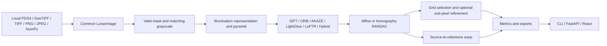

# LunaMatch

**LunaMatch — AI-Assisted Multi-Modal Lunar Image Correspondence & Registration**

*AI proposes. Geometry verifies. Sub-pixel optimization refines.*

Research prototype for Smart India Hackathon 2026 problem **SIH26166**: correspondence between Chandrayaan-2 OHRC, TMC-2, and IIRS optical imagery under illumination, viewpoint, scale, resolution, and modality changes. This repository is an independent prototype; it does not claim ISRO endorsement.

## Current working scope

The CLI, FastAPI service, and React dashboard run locally. Ingestion supports PDS4 image products, GeoTIFF/TIFF, PNG/JPEG, and NumPy arrays. SIFT, ORB, AKAZE, pretrained SuperPoint + LightGlue, pretrained LoFTR, and a SIFT + LoFTR hybrid feed affine or homography RANSAC. Optional illumination representations, pyramid matching, grid selection, and local sub-pixel coordinate refinement are implemented. IIRS cubes can be reduced to a PCA spatial plane or processed by band. CSV, JSON, TIFF, and PNG exports and a benchmark runner are included. TMC-2 browse quicklooks and bounded native-resolution science-image windows have been registered; full-strip processing and independent accuracy validation remain unevaluated.

## Architecture



Modules live in `src/lunamatch/`; the ingestion, preprocessing, features, matching, geometry, distribution, evaluation, and pipeline boundaries allow later methods to replace individual stages. `data/raw`, `data/calibrated`, and `data/processed` are separate by design. The software does not calibrate raw products automatically.

## Install

Python 3.11 or newer is required. In the repository root:

```bash
python3 -m venv .venv
.venv/bin/python -m pip install -e '.[planetary,api,test]'
```

The planetary extra installs `rasterio` and `pds4-tools`. OpenCV 4 is pinned because the current OpenCV 5 wheel tested here omits AKAZE.

For LoFTR and Hybrid, install CPU PyTorch and Kornia:

```bash
.venv/bin/python -m pip install torch --index-url https://download.pytorch.org/whl/cpu
.venv/bin/python -m pip install -e '.[learned]'
```

Pretrained outdoor LoFTR weights download on first use and are cached in `LUNAMATCH_MODEL_CACHE` or a per-user temporary directory. Set a durable writable cache path for offline reuse. CPU inference was tested; CUDA availability is reported but GPU inference has not been tested here. A missing model or weights returns an explicit error.

For SuperPoint + LightGlue, install the official CVG repository and CPU torchvision. Use `--no-deps` on the repository install because its unpinned `opencv-python` requirement currently resolves to OpenCV 5, which breaks the AKAZE baseline in this environment:

```bash
.venv/bin/python -m pip install torchvision --index-url https://download.pytorch.org/whl/cpu
.venv/bin/python -m pip install --no-deps 'git+https://github.com/cvg/LightGlue.git@eb42fee2d71449efb0aa5c10549752b5d75384d8'
```

The official SuperPoint and LightGlue weights download on first use into the same cache. Both learned matchers and Hybrid passed local CPU smoke tests on generated image pairs. Run those opt-in tests after the weights are cached with `LUNAMATCH_TEST_LEARNED=1 .venv/bin/python -m pytest tests/matching/test_optional_learned.py`.

## Inspect images

Keep official/public products in `data/raw/`, calibrated products in `data/calibrated/`, and derived products in `data/processed/`. For PDS4, retain the XML label and its referenced binary files together. The first supported numeric 2D/3D array is loaded. Three dimensional PDS4 arrays need explicit Line, Sample, and Band axes. The input metadata is preserved; missing fields are `null`. GeoTIFF pixel scale is populated only for a projected CRS with metre units and nearly equal axis scales; the matching report records a scale ratio when both products provide one.

For large uncompressed two dimensional PDS4 images, `inspect --window X Y WIDTH HEIGHT` and `register --source-window ... --reference-window ...` read only the requested science pixels from the labeled binary. Input window coordinates use the full image pixel grid, starting at zero; ordinary registration exports use crop-local coordinates. The science-window experiment below also exports full-image coordinates. The current window reader supports Line then Sample arrays with Last Index Fastest order and listed integer or floating point PDS4 element types; unsupported layouts fail with an explicit error. Three dimensional IIRS cubes still use the regular PDS4 loader and its memory limit.

```bash
.venv/bin/python -m lunamatch inspect --input data/raw/product.xml --sensor OHRC --data-level raw --preview results/preview.png
.venv/bin/python -m lunamatch inspect --input data/raw/image.tif --preview results/preview.png --band 0
```

Inspection previews use a percentile display stretch. They do not change source pixels or imply radiometric calibration. Large files over 2 GiB or images over 150 million pixels are rejected; tiled processing is planned.

### Inspect and stage PRADAN product ZIPs

PRADAN observation products arrive as ZIP archives. Inventory a ZIP before extraction:

```bash
.venv/bin/python -m lunamatch inspect-product --input data/raw2/ch2_ohr_product.zip
```

The inventory reports inferred sensor/data level only when explicit filename or directory tokens exist, plus XML labels, likely image members, and expanded size. Stage a product while preserving its internal paths:

```bash
.venv/bin/python -m lunamatch stage-product \
  --input data/raw2/ch2_ohr_product.zip --output data
```

Products are placed under `data/<data-level>/<sensor>/<archive-name>/` with a manifest. The command rejects path traversal, symlinks, encrypted members, documentation-only bundles, oversized archives, and existing destinations. It does not calibrate raw data or assume that browse images are science rasters. Keep source downloads in `data/raw/`; staging writes extracted content into sensor/level folders and leaves the archive untouched.

## Run the classical baseline

Generate the included **synthetic software-test pair**:

```bash
.venv/bin/python experiments/generate_sample.py
.venv/bin/python -m lunamatch register \
  --source data/samples/synthetic_source.png \
  --reference data/samples/synthetic_reference.png \
  --source-sensor OHRC --reference-sensor OHRC \
  --matcher sift --output results/sample
```

`generate_sample.py` creates four deterministic software-test pairs in `data/samples/`: translation, affine scale/rotation, illumination change, and noise/blur. They are synthetic fixtures only and are not Chandrayaan-2 validation data.

Use `--matcher orb`, `akaze`, `lightglue`, `loftr`, or `hybrid` for other methods; `--geometry affine` selects affine RANSAC. `--clahe` enables local contrast enhancement. `--config configs/default.yaml` loads supported YAML settings, and explicit CLI flags override them. The YAML also controls illumination normalization, gradients, a heuristic shadow mask, pyramid levels, IIRS PCA or band selection, grid limits, and optional sub-pixel refinement.

## Trainable descriptor

The repository includes a small trainable `LunarPatchDescriptor` for local representation pretraining. It uses a symmetric in-batch InfoNCE loss on photometric and flip augmentations, writes a PyTorch checkpoint plus a JSON training log, and reports the selected CPU/CUDA device. This model is a research component; it is not a Chandrayaan-2 accuracy result and is not silently substituted for SIFT.

Install the optional dependencies and train on declared local pixels:

```bash
pip install -e '.[learned]'
python -m lunamatch train-descriptor \
  --input data/samples/synthetic_source.png \
  --output results/descriptor_pretraining/lunar_patch_descriptor.pt \
  --epochs 5 --samples 2048 --device auto
```

The same implementation is available as `experiments/train_descriptor.py`. Use the configuration template at `experiments/configs/train_descriptor.yaml` when building a reproducible run. Training now creates paired local views with small rotation, scale, translation, blur, contrast, gamma, shadow-like bias, and noise changes, then optimizes symmetric in-batch InfoNCE. The report includes augmentation-pair retrieval (`alignment_top1`); this is a training diagnostic, not registration accuracy. Supervised correspondence fine-tuning requires labeled tie points or known transformations and remains pending.

To use the trained model in the CLI, set `LUNAMATCH_DESCRIPTOR_CHECKPOINT` to the checkpoint path and select `--matcher descriptor`. The FastAPI and React interfaces expose the same **LunaPatchDescriptor (trained)** matcher; configure the API process with that environment variable before selecting it in the dashboard. If no checkpoint is configured, the API returns a clear unavailable-model error rather than silently falling back to a classical matcher.

The result directory contains `registered_image.tif`, browser PNG previews, selected `matches.csv/json`, all `candidate_matches.csv/json`, `transformation.json`, `metrics.json`, `job_log.json`, `overlay.png`, `match_visualization.png`, `error_map.png`, `confidence_map.png`, and `distribution.png`. The TIFF warps source pixels while preserving their supported numeric bit depth and copies reference CRS/transform when available; PNGs are display representations. The matrix maps **source pixels to reference pixels**. `registration_residual_rmse_px` is the RANSAC inlier reprojection residual. `ground_truth_rmse_px` is `null` because independent ground truth has not been supplied. `selected_coverage` measures occupied cells of an 8×8 reference-image grid. Confidence scores are not calibrated probabilities. The error and confidence maps show **sparse point markers**, not dense truth fields. Fractional refined coordinates are estimates; sub-pixel accuracy remains unvalidated.

## Run tests

```bash
.venv/bin/python -m pytest -q
```

## Dataset preparation and research limits

Official Chandrayaan-2 imaging products are listed in the [ISRO/ISSDC PRADAN Chandrayaan-2 archive](https://pradan.issdc.gov.in/ch2/). The [data explorer](https://chmapbrowse.issdc.gov.in/) currently requires users to register and log in to download orbiter imaging products. ISRO states that the data is free for non-profit scientific use and remains ISRO property; review the [archive terms](https://pradan.issdc.gov.in/ch2/disclaimer.xhtml) before use. Locally supplied archives are inventoried in `data/processed/raw_inventory.csv` and `raw_inventory.json`; no source archives were modified. PDS4 labels and image files should be kept together when the label references the data file.

`data/raw2` has a separate [initial inventory](data/processed/raw2_inventory.csv) and a live [sensor product inventory](data/processed/sensor_product_inventory.json). The initial inventory describes the instrument bundles and footprint shapefiles; it predates the TMC-2 product downloads. The LTA assembly note says observation product ZIPs must be downloaded separately. Generate a fresh count with `python experiments/inventory_sensor_data.py`.

Current workspace inventory: TMC-2 has 15 complete product ZIPs downloaded, of which five selected same-pass products are staged; one additional download is incomplete. OHRC has five complete calibrated product ZIPs and all five are staged. IIRS has four complete derived product ZIPs and all four are staged; its fifth transfer is incomplete. The existing `ohr.zip`, `iir.zip`, and shapefile ZIPs are ancillary instrument metadata/footprints, not observation products. Counts are recalculated by the inventory script and include flat product archives under `data/raw2/`.

The local inventory contains calibrated TMC-2 browse products, raw TMC-2 browse products, sensor footprint shapefiles, TMC geolocation grids, and instrument documentation. It also contains ancillary CHACE-2, CLASS, DFSAR/SAR, and XSM material outside the optical matcher scope. Several year archives are incomplete `.part` files or zero-byte placeholders and were left untouched. The available browse-image archive includes 330 calibrated TMC-2 PNGs for 2019, plus raw browse PNG archives for 2019–2021; these are quicklook images rather than full-resolution science products. A calibrated fore/nadir/aft triplet with its XML labels was extracted to `data/calibrated/TMC-2/browse_2019_10_15/`.

To process all available TMC-2 browse stereo pairs directly from their ZIP archives, run:

```bash
.venv/bin/python experiments/process_pradan_tmc_browse.py \
  --archive-dir data/raw --output results/pradan_tmc2_browse_all
```

This matches fore/nadir and aft/nadir products by PDS4 acquisition timestamps, registers them with SIFT and homography RANSAC, and writes `pair_manifest.csv`, `pair_metrics.csv`, selected tie points, per-year/view summary JSON, and representative full artifact bundles. The current batch completed 1,494/1,494 pairs: 440 raw and 220 calibrated pairs from 2019, plus 538 raw pairs from 2020 and 516 from 2021. These are browse-pair pipeline measurements only; ground-truth error was not measured, and successful RANSAC fitting does not establish scientific accuracy.

Some browse rasters exceed OpenCV's per-axis warp limit. The geometry warp handles large source or destination dimensions with bounded tiles, so those scenes can be registered without silently truncating the image.

Prepare the sensor footprint layers and index calibrated TMC geolocation grid labels with:

```bash
.venv/bin/python experiments/prepare_pradan_spatial_assets.py \
  --archive-dir data/raw --output-dir data/processed/spatial
```

This extracts the original OHRC, TMC-2, and IIRS shapefile components for GIS use and writes `tmc_geolocation_index.csv/json`, linking geolocation product labels to matching available browse products. It indexes label-declared grid counts; it does not yet interpolate geolocation grids at tie points or claim ground-truth accuracy.

The five-product TMC-2 prototype has a repeatable four-pair run:

```bash
.venv/bin/python experiments/prepare_tmc2_prototype.py
.venv/bin/python experiments/process_tmc2_prototype.py
.venv/bin/python experiments/inventory_sensor_data.py
```

It registers calibrated nadir-to-aft, calibrated nadir-to-fore, raw nadir-to-fore, and same-view raw-to-calibrated nadir browse quicklooks. The report and CSV are in `data/processed/tmc2_prototype_report.json` and `tmc2_prototype_metrics.csv`; registered TIFFs and visualizations are under `results/tmc2_prototype/`. These are operational quicklook results, not full-resolution science-image validation. RANSAC residual is not ground-truth error, and independent tie points are unavailable.

When a PNG/JPEG has a same-stem PDS4 XML sidecar, the loader retains available acquisition and instrument fields; missing fields remain `null`. Independent ground truth is unavailable for the current pairs.

The staged OHRC and IIRS products can be checked with the same CLI baseline. Example browse runs are recorded in `results/ohrc_browse_20260103_1203_to_1005/` and `results/iirs_browse_20240518_1906_to_1709/`; they use official browse PNGs and PDS4 sidecar labels. The OHRC check produced 697 inliers from 2,431 matches with 54.7% selected coverage. The IIRS check produced 757 inliers from 1,526 matches with 37.5% selected coverage. These are quicklook registration measurements, not ground-truth accuracy.

The IIRS science cubes contain 256 bands and are several gigabytes each. The current PDS4 loader deliberately refuses a full cube above its memory limit; bounded band/window loading is the next IIRS implementation step.

To register native-resolution TMC-2 windows from the same five products, first run the browse experiment above, then:

```bash
.venv/bin/python experiments/process_tmc2_science_windows.py \
  --reference-window 1000 20000 2048 2048
```

This run selects overlapping stereo source windows using the measured browse transformations and the actual browse/science dimensions. SIFT and RANSAC then operate on native IMG pixels. It writes full-image pixel tie points and transforms beside each crop result under `results/tmc2_science_prototype/`, with a summary in `data/processed/tmc2_science_window_report.json`. The browse transform locates the crops; it is not passed to native-resolution RANSAC. The default window registered calibrated fore/nadir and aft/nadir with 2,739 and 2,742 inliers, and a raw/calibrated nadir pair with 5,287 inliers. Their fitted reprojection residual RMSEs were 1.44, 1.49, and 0.10 pixels respectively. These are three crop-pair pipeline measurements on official imagery, without independent truth data.

Sensor labels supplied with `--sensor` are user declarations; a PNG test image labeled OHRC does not become an OHRC observation. Full-strip TMC-2/OHRC processing, IIRS cube registration, cross-modal matching, and lunar-reference registration remain **not evaluated yet**. A homography is a local image warp and may be physically insufficient for terrain relief and differing views. Calibrated lunar reference geodesy, a GPU inference test, and a rigorous ground-truth sub-pixel study remain open.

## API and dashboard

Run the backend and frontend in separate terminals:

```bash
.venv/bin/python -m uvicorn api.main:app --host 127.0.0.1 --port 8000
cd frontend && npm ci && npm run dev
```

Open `http://localhost:5173`. The dashboard uploads a source and reference, selects sensors and matcher, configures processing, shows imagery and metrics, filters all/inlier/high-confidence points, compares before and after, and downloads artifacts. Browser uploads accept PNG/JPEG/TIFF/GeoTIFF up to 100 MB by default. PDS4 labels with external binary sidecars should be processed with the local CLI; the upload endpoint does not accept XML. Uploads use temporary directories cleaned after processing. Set `LUNAMATCH_RESULTS_DIR` and `LUNAMATCH_MAX_UPLOAD_BYTES` for deployment. Jobs are synchronous and stored on disk; a queue and retention policy are future work.

API endpoints are `POST /api/v1/register`, `GET /api/v1/results/{job_id}`, `/matches`, `/candidates`, `/metrics`, `/registered-image`, and `/artifacts/{name}`. The POST body is multipart `source`, `reference`, `source_sensor`, `reference_sensor`, `matcher`, and a JSON string `preprocessing`. OpenAPI details are available at `http://127.0.0.1:8000/docs`.

## Experiments and ablation

```bash
.venv/bin/python -m lunamatch benchmark --config experiments/configs/baseline.yaml --output results/baseline
.venv/bin/python -m lunamatch benchmark --config experiments/configs/ablation.yaml --output results/ablation
```

Configs also cover illumination, scale, a LightGlue/LoFTR comparison, and synthetic IIRS-to-grayscale matching. Ablation A–F adds illumination normalization, multi-scale, hybrid AI, spatial selection, then sub-pixel refinement. Each run emits CSV/JSON rows with a `synthetic` flag; failed runs record an error and blank measurements. No benchmark table is prefilled with invented values.

## Docker and remaining work

```bash
docker compose up --build
```

Compose exposes the API on port 8000 and dashboard on port 5173. Both images built, and a local smoke test returned API health plus the dashboard HTML. Real OHRC/TMC-2/IIRS pairs must be prepared and independently evaluated before any scientific performance claim.
