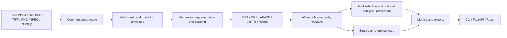

# LunaMatch

**LunaMatch — AI-Assisted Multi-Modal Lunar Image Correspondence & Registration**

*AI proposes. Geometry verifies. Sub-pixel optimization refines.*

Research prototype for Smart India Hackathon 2026 problem **SIH26166**: correspondence between Chandrayaan-2 OHRC, TMC-2, and IIRS optical imagery under illumination, viewpoint, scale, resolution, and modality changes. This repository is an independent prototype; it does not claim ISRO endorsement or validation on Chandrayaan-2 products.

## Current working scope

The CLI, FastAPI service, and React dashboard run locally. Ingestion supports PDS4 image products, GeoTIFF/TIFF, PNG/JPEG, and NumPy arrays. SIFT, ORB, AKAZE, pretrained LoFTR, and a SIFT + LoFTR hybrid feed affine or homography RANSAC. Optional illumination representations, pyramid matching, grid selection, and local sub-pixel coordinate refinement are implemented. IIRS cubes can be reduced to a PCA spatial plane or processed by band. CSV, JSON, TIFF, and PNG exports and a benchmark runner are included. **Real Chandrayaan-2 registration has not been evaluated yet.** Automated and example runs use generated imagery.

## Architecture



Modules live in `src/lunamatch/`; the ingestion, preprocessing, features, matching, geometry, distribution, evaluation, and pipeline boundaries allow later methods to replace individual stages. `data/raw`, `data/calibrated`, and `data/processed` are separate by design. The software does not calibrate raw products automatically.

## Install

Python 3.11 or newer is required. In the repository root:

```bash
python3 -m venv .venv
.venv/bin/python -m pip install -e '.[planetary,api,test]'
```

The planetary extra installs `rasterio` and `pds4-tools`. OpenCV 4 is pinned because the current OpenCV 5 wheel tested here omits AKAZE.

For LoFTR and Hybrid, install CPU PyTorch and Kornia:

```bash
.venv/bin/python -m pip install torch --index-url https://download.pytorch.org/whl/cpu
.venv/bin/python -m pip install -e '.[learned]'
```

Pretrained outdoor LoFTR weights download on first use and are cached in `LUNAMATCH_MODEL_CACHE` or a per-user temporary directory. Set a durable writable cache path for offline reuse. CPU inference was tested; CUDA availability is reported but GPU inference has not been tested here. A missing model or weights returns an explicit error.

## Inspect images

Keep official/public products in `data/raw/`, calibrated products in `data/calibrated/`, and derived products in `data/processed/`. For PDS4, retain the XML label and its referenced binary files together. The first supported numeric 2D/3D array is loaded. Three dimensional PDS4 arrays need explicit Line, Sample, and Band axes. The input metadata is preserved; missing fields are `null`. GeoTIFF pixel scale is populated only for a projected CRS with metre units and nearly equal axis scales; the matching report records a scale ratio when both products provide one.

```bash
.venv/bin/python -m lunamatch inspect --input data/raw/product.xml --sensor OHRC --data-level raw --preview results/preview.png
.venv/bin/python -m lunamatch inspect --input data/raw/image.tif --preview results/preview.png --band 0
```

Inspection previews use a percentile display stretch. They do not change source pixels or imply radiometric calibration. Large files over 2 GiB or images over 150 million pixels are rejected; tiled processing is planned.

## Run the classical baseline

Generate the included **synthetic software-test pair**:

```bash
.venv/bin/python experiments/generate_sample.py
.venv/bin/python -m lunamatch register \
  --source data/samples/synthetic_source.png \
  --reference data/samples/synthetic_reference.png \
  --source-sensor OHRC --reference-sensor OHRC \
  --matcher sift --output results/sample
```

Use `--matcher orb`, `akaze`, `loftr`, or `hybrid` for other methods; `--geometry affine` selects affine RANSAC. `--clahe` enables local contrast enhancement. `--config configs/default.yaml` loads supported YAML settings, and explicit CLI flags override them. The YAML also controls illumination normalization, gradients, a heuristic shadow mask, pyramid levels, IIRS PCA or band selection, grid limits, and optional sub-pixel refinement.

The result directory contains `registered_image.tif`, browser PNG previews, selected `matches.csv/json`, all `candidate_matches.csv/json`, `transformation.json`, `metrics.json`, `job_log.json`, `overlay.png`, `match_visualization.png`, `error_map.png`, `confidence_map.png`, and `distribution.png`. The TIFF warps source pixels while preserving their supported numeric bit depth and copies reference CRS/transform when available; PNGs are display representations. The matrix maps **source pixels to reference pixels**. `registration_residual_rmse_px` is the RANSAC inlier reprojection residual. `ground_truth_rmse_px` is `null` because independent ground truth has not been supplied. `selected_coverage` measures occupied cells of an 8×8 reference-image grid. Confidence scores are not calibrated probabilities. The error and confidence maps show **sparse point markers**, not dense truth fields. Fractional refined coordinates are estimates; sub-pixel accuracy remains unvalidated.

## Run tests

```bash
.venv/bin/python -m pytest -q
```

## Dataset preparation and research limits

Official/public Chandrayaan-2 products should be obtained from the ISRO/ISSDC PRADAN archive according to its access terms. No archive data is bundled here. Sensor labels supplied with `--sensor` are user declarations; a PNG test image labeled OHRC does not become an OHRC observation. Synthetic IIRS PCA and band-selection experiments verify software plumbing only; real cross-modal matching is **not evaluated yet**. A homography is a local image warp and may be physically insufficient for terrain relief and differing views. Large-image tiling, calibrated lunar reference geodesy, a GPU inference test, and a rigorous ground-truth sub-pixel study remain open. SuperPoint + LightGlue is not integrated.

## API and dashboard

Run the backend and frontend in separate terminals:

```bash
.venv/bin/python -m uvicorn api.main:app --host 127.0.0.1 --port 8000
cd frontend && npm ci && npm run dev
```

Open `http://localhost:5173`. The dashboard uploads a source and reference, selects sensors and matcher, configures processing, shows imagery and metrics, filters all/inlier/high-confidence points, compares before and after, and downloads artifacts. Browser uploads accept PNG/JPEG/TIFF/GeoTIFF up to 100 MB by default. PDS4 labels with external binary sidecars should be processed with the local CLI; the upload endpoint does not accept XML. Uploads use temporary directories cleaned after processing. Set `LUNAMATCH_RESULTS_DIR` and `LUNAMATCH_MAX_UPLOAD_BYTES` for deployment. Jobs are synchronous and stored on disk; a queue and retention policy are future work.

API endpoints are `POST /api/v1/register`, `GET /api/v1/results/{job_id}`, `/matches`, `/candidates`, `/metrics`, `/registered-image`, and `/artifacts/{name}`. The POST body is multipart `source`, `reference`, `source_sensor`, `reference_sensor`, `matcher`, and a JSON string `preprocessing`. OpenAPI details are available at `http://127.0.0.1:8000/docs`.

## Experiments and ablation

```bash
.venv/bin/python -m lunamatch benchmark --config experiments/configs/baseline.yaml --output results/baseline
.venv/bin/python -m lunamatch benchmark --config experiments/configs/ablation.yaml --output results/ablation
```

Configs also cover illumination, scale, and synthetic IIRS-to-grayscale matching. Ablation A–F adds illumination normalization, multi-scale, hybrid AI, spatial selection, then sub-pixel refinement. Each run emits CSV/JSON rows with a `synthetic` flag; failed runs record an error and blank measurements. No benchmark table is prefilled with invented values.

## Docker and remaining work

```bash
docker compose up --build
```

Compose exposes the API on port 8000 and dashboard on port 5173. The Compose syntax was checked, but full images have not been built here. Real OHRC/TMC-2/IIRS pairs must be prepared and independently evaluated before any scientific performance claim.
